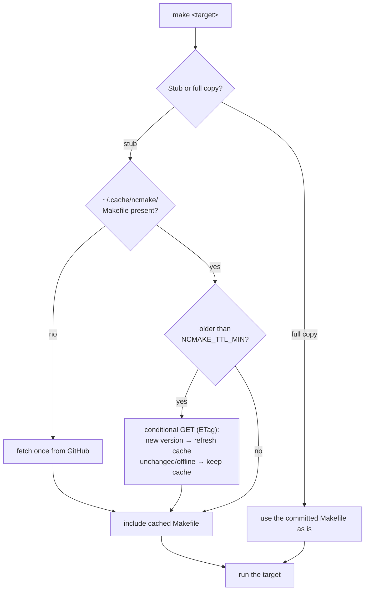
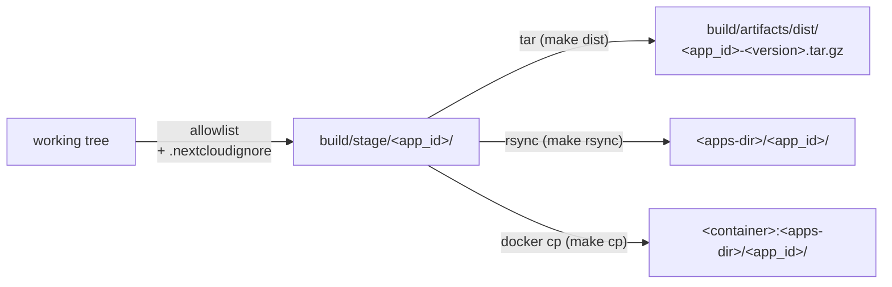
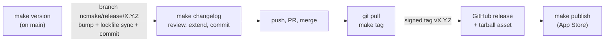

<!--
  - SPDX-FileCopyrightText: 2026 [ernolf] Raphael Gradenwitz <raphael.gradenwitz@googlemail.com>
  - SPDX-License-Identifier: MIT
-->
# ncmake

The Swiss Army knife for Nextcloud app development: one generic `Makefile` for building, packaging, deploying, versioning and App Store management of a Nextcloud app.

Everything is derived from the app itself, so there is nothing to configure for a standard app: drop it in, run `make`, done. The package managers run in throwaway containers, so the host needs neither PHP nor Node.

> [!TIP]
> **TL;DR** — Commit the [bootstrap stub](#-installation) as your app's `Makefile`, then `make` gives you build, packaging, test-deploy, release and App Store targets — all in throwaway containers, so no PHP or Node on your host. `make` alone prints a colorized, annotated help; `make help-<target>` explains one target in depth.

- [Installation](#-installation)
- [What happens when you run make](#-what-happens-when-you-run-make)
- [How ncmake understands your app](#-how-ncmake-understands-your-app)
- [The container runtime](#-the-container-runtime)
- [Building](#-building)
- [Packaging: the shipped file set](#-packaging-the-shipped-file-set)
- [Deploying to a test instance](#-deploying-to-a-test-instance)
- [Releasing](#-releasing)
- [CI workflows](#-ci-workflows)
- [The Installation section for your app's README](#-the-installation-section-for-your-apps-readme)
- [App Store management](#-app-store-management)
- [Per-app tuning](#-per-app-tuning)
- [Variables](#-variables)
- [Target reference](#-target-reference)
- [Requirements](#-requirements)
- [Show that your app uses ncmake](#-show-that-your-app-uses-ncmake)

## 🧩 Installation

### The bootstrap stub (recommended)

Put the bootstrap stub into the root of your app repository, once:

```sh
curl -fLO https://raw.githubusercontent.com/ernolf/ncmake/main/bootstrap/Makefile
git add Makefile
```

The stub is a dozen lines that never change. It fetches the real Makefile into a per-machine cache and includes it from there. Every developer who clones your app and runs `make` automatically gets the current ncmake, on every machine, for every app, from one shared cache.

The stub is the only thing you install by hand. Everything else ncmake contributes to your repository — the CI workflows (see [CI workflows](#-ci-workflows)) — is installed and updated through `make` targets once the stub is in place.

> [!IMPORTANT]
> **Only the stub lands in your repository.** The stub file you committed stays byte-identical forever; the fetched Makefile lives in `~/.cache/ncmake/`, outside of every project. Running `make` creates or modifies nothing in your checkout (apart from the usual build outputs such as `build/`, `js/` and `vendor/`, which belong in your `.gitignore` anyway, as in every Nextcloud app). `git status` stays clean; there is nothing extra to ignore.

**How the cache stays current.** At most once per day (`NCMAKE_TTL_MIN`, default 1440 minutes) the cached Makefile checks upstream with a conditional GET (ETag): unchanged or offline keeps the cache, a new version replaces it and is used from the next run on. `make self-update` forces a refresh at any time.

**Pinning a version.** By default the stub follows the `main` branch. To pin your app to a fixed ncmake version, set `NCMAKE_REF` in the stub to a tag:

```make
NCMAKE_REF ?= v1.0.0
```

### The full copy (self-contained alternative)

If you prefer a repository without any fetch-at-build-time behavior, commit the full `Makefile` instead:

```sh
curl -fLo Makefile https://raw.githubusercontent.com/ernolf/ncmake/main/core/Makefile
```

A committed copy never modifies itself. `make self-update` downloads the newest version over it; review the diff and commit it like any other change.

## 🔍 What happens when you run make



The first `make` after a fresh `git clone` needs network once (to fill the cache); after that everything works offline.

## 🧠 How ncmake understands your app

Nothing is configured twice, everything is read from files your app has anyway:

| Fact | Source |
|---|---|
| App id | `<id>` in `appinfo/info.xml` |
| Version | `<version>` in `appinfo/info.xml` |
| PHP build needed? | `composer.json` declares runtime requirements (anything besides `php` and `ext-*`) |
| Frontend build needed? | `package.json` has a `build` script |
| Is `js/` (or `vendor/`) a build artifact? | `.gitignore` (evaluated via `git check-ignore`) |
| PHP container image | minimum PHP version in `appinfo/info.xml` |
| Node container image | `engines.node` in `package.json` |

The `.gitignore` line deserves a word: when `js/` is gitignored, it is a build output and must exist before packaging (`make dist` refuses otherwise and tells you to run `make build`). When `js/` is committed, as in apps that ship their built frontend in git, a fresh checkout is already complete and packages without building. The same logic applies to `vendor/`.

The tarball and the deployed directory are always named after the **app id**, regardless of what your checkout directory is called.

## 🐳 The container runtime

`composer` and `npm` never run on your host by default. Each invocation starts a throwaway container (`--rm`), does its work in your bind-mounted checkout and disappears. Your host needs no PHP, no Node, no version juggling, and you can build against exactly the PHP the app declares as its minimum.

The runtime is auto-detected (podman preferred, then docker) and can be chosen per call, for example `make build RUNTIME=docker`:

| `RUNTIME=` | What it is | Notes |
|---|---|---|
| `podman` | rootless podman (default when podman exists) | daemonless, no idle cost, files owned by you |
| `docker` | standard rootful docker | ncmake maps your uid/gid into the container, so no root-owned files appear |
| `docker-rootless` | rootless docker | |
| `bare` | no container | composer and npm must be on the PATH |

The images are derived, never hardcoded: PHP runs in `ghcr.io/nextcloud/continuous-integration-php<min>` (the same images the Nextcloud CI uses, with all required extensions), Node in `node:<major>` from your `engines.node`. Both can be overridden (see [Variables](#-variables)).

> [!CAUTION]
> On SELinux hosts (Fedora, RHEL) bind mounts may need a `:z` label. If you hit permission errors there, run with `RUNTIME=bare` or adjust your container policy.

## 🔨 Building

```sh
make build
```

runs the detected build commands, each in its container:

- `composer install --no-dev --no-scripts --prefer-dist --no-progress` when `composer.json` declares runtime requirements
- `npm ci && npm run build` when `package.json` has a `build` script

When a side does not apply, it is skipped with a note. Apps with special build steps override the commands in `ncmake.mk` (see [Per-app tuning](#-per-app-tuning)).

For everything beyond the release build there are generic pass-through targets running in the same throwaway containers — the host needs no toolchain even for the dev setup:

```sh
make composer ARGS=install       # install dependencies INCLUDING dev tools (vendor-bin etc.)
make composer ARGS="cs:check"    # run a composer script
make npm ARGS=ci                 # install frontend dependencies
make npm ARGS="run test"         # run the frontend tests
```

`make dist-clean` resets to a pristine checkout first (it removes every git-ignored build output: `vendor/`, `node_modules/`, `js/`, caches), so

```sh
make dist-clean && make build
```

is the reproducible from-scratch build.

## 📦 Packaging: the shipped file set

What ends up in a release is defined as an **allowlist** (the keep model), not as an exclude list. Shipped are the standard app paths, each only when it exists:

```
appinfo/ lib/ l10n/ templates/ img/ css/ js/ vendor/ LICENSES/
CHANGELOG.md AUTHORS.md REUSE.toml COPYING COPYING.md LICENSE LICENSE.md
```

> [!NOTE]
> A new dev file in your repository can never leak into the tarball, because it is not on the list. A missing runtime directory fails loudly instead of silently shipping a broken app.



`make dist` materializes the file set once into a staging directory and packs it; `make rsync` and `make cp` deploy the very same staging directory. One mechanism, one source of truth: what you deploy for testing is byte-for-byte what a release ships.

## 🚀 Deploying to a test instance

```sh
make build
make rsync TARGET=/var/www/nextcloud/apps OCC=1
```

`make rsync` deploys the shipped file set straight into an `apps/` directory (local or over SSH); `make cp` does the same into a running container such as Nextcloud All-in-One. `OCC=1` wraps the sync into the full `occ app:disable → chown → occ app:enable` refresh cycle, so `info.xml` is re-read and migrations run. `make dist`, `make rsync` and `make cp` all deploy the very same staged file set — one source of truth, byte-for-byte what a release ships.

The full walkthrough — `TARGET` forms, remote SSH, `ENGINE`, `web_user`, the `-it`/TTY detail — lives in the install guide: **[Method 3: `make rsync`](doc/INSTALL.md#-method-3--deploy-with-make-rsync)** and **[Method 4: `make cp`](doc/INSTALL.md#-method-4--deploy-into-a-running-container-with-make-cp)**.

> [!TIP]
> That guide is written for the people who *install* your app rather than develop it, so every ncmake app can link its users straight to [doc/INSTALL.md](doc/INSTALL.md) and [keep its own README down to a couple of lines](#-the-installation-section-for-your-apps-readme).

## 🚢 Releasing

The release flow assumes a protected `main` (required checks, no direct pushes), which is good practice anyway:



**`make version`** (run on `main`) prompts for the new version, validates it against the latest tag (`sort -V`, must be greater), branches off into `ncmake/release/X.Y.Z` (branches created by ncmake always carry the `ncmake/` prefix, so they are immediately distinguishable from hand-made branches) and commits the bump there: `appinfo/info.xml`, plus `composer.json`/`package.json` when present, plus the re-synced lockfiles (synced inside the containers, so the bump commit is complete and CI-clean).

**`make changelog`** (on the release branch) generates the `## [X.Y.Z]` section for the version in `info.xml` from the conventional commits since the last tag, and inserts it above the previous release, together with its `[X.Y.Z]:` link reference to the GitHub release tag (the repository URL is derived from the origin remote). Only user-visible changes make it in: `feat` becomes *Added*, `fix` becomes *Fixed*, `perf` becomes *Changed*; build, ci, test, chore, docs, refactor, style, merge commits and the daily Transifex bot commits are left out. The rest of the file is never touched, so the generated section can be freely edited and extended before committing, and hand-written history survives. It also prints the exact commit command: while the bump commit from make version is still unpushed, the changelog is folded into it via git commit --amend --no-edit (one commit per release); otherwise it suggests a separate build(release): update changelog for X.Y.Z commit. Rerunning is safe: an existing section is not duplicated, and when nothing user-visible happened since the last tag it says so (add a hand-written section then, for example for translation updates). It runs `git-cliff` via `npx` in the node container; an app-provided `cliff.toml` overrides the built-in configuration.

**`make tag`** (back on `main`, after the merge) refuses to re-tag, refuses when `CHANGELOG.md` has no `## [X.Y.Z]` section, shows a fat reminder that a tag freezes the current commit, then creates and pushes the **signed** `vX.Y.Z` tag after your confirmation.

`make dist` builds the tarball to attach to the GitHub release; `make sign` (base64 signature) and `make release` (dist + sign) come from the [appstore module](#-app-store-management).

## 🤖 CI workflows

The workflows of an ncmake app are managed by the **workflow manager**, a developer module: `make dev-init` fetches the ncmake modules once per machine, then

```sh
make workflows-list
make workflows-install W="release reuse lint-php"
git add .github/workflows/
```

lists everything the sources offer — ncmake's own release workflow plus the official [nextcloud/.github workflow templates](https://github.com/nextcloud/.github/tree/master/workflow-templates) — installs your pick and records the provenance in a lock file, so `make workflows-update` later distinguishes upstream updates from your local edits. Discovery is live via the GitHub API: new upstream templates appear in the list without any ncmake update.

The full guide — module setup, sources, status model, the lock file, placeholder handling and the release workflow ncmake ships itself — lives in **[doc/WORKFLOWS.md](doc/WORKFLOWS.md)**.

ncmake can also keep the workflows current for you: the [workflow updater](doc/AUTOUPDATE_WORKFLOW.md) opens a pull request when they drift from upstream. It replaces Dependabot for `.github/workflows/` and authenticates with a [GitHub App](doc/GITHUB_APP.md).

## 📝 The Installation section for your app's README

Every ncmake app's install instructions should read the same and stay short: one line for the App Store, one that points at the shared [install guide](doc/INSTALL.md). Do not repeat tarball or `make` steps in the app README — they live in the guide, in one place, so a change is made once.

If the app is in the App Store:

```markdown
## Installation

The app is published in the [App Store](https://apps.nextcloud.com/apps/<app>). Install it through [Nextcloud's app management UI](https://docs.nextcloud.com/server/latest/admin_manual/apps_management.html#managing-apps) (**Apps** → search for **<App name>** → Install) or with `occ app:enable <app>`.

It is built with [ncmake](https://github.com/ernolf/ncmake). To build and install it from source — release tarball, `make rsync` or `make cp` — see the [installation guide](https://github.com/ernolf/ncmake/blob/main/doc/INSTALL.md).
```

If it is not (yet) in the App Store, drop the first paragraph:

```markdown
## Installation

This app is not yet in the App Store. It is built with [ncmake](https://github.com/ernolf/ncmake). To build and install it from source — release tarball, `make rsync` or `make cp` — see the [installation guide](https://github.com/ernolf/ncmake/blob/main/doc/INSTALL.md).
```

Replace `<app>` with the app id and `<App name>` with the app's display name (the exact term users search for in the App Store). Anything genuinely app-specific — a migration note, a link to the app's own developer docs — follows as its own subsection.

## 🏪 App Store management

Everything that talks to the [App Store](https://apps.nextcloud.com) or needs the signing key lives in the **appstore module**, another developer module: `make dev-init` once, then

```sh
make csr             # one-time: key + certificate request
make register        # one-time: register app id and certificate
make publish GH=1    # per release: sign and submit the GitHub release asset
```

plus the read-only queries (`list-releases`, `ratings`, ...), `delete-release` and the signing building blocks `sign` and `release`. `NIGHTLY=1` switches `publish` and `delete-release` to the store's nightly channel. `make help` shows whether token, certificate and key are in place (green check or red cross, with the real filename).

The full guide — certificate directory, onboarding walkthrough, the publish flow and why it signs the downloaded bytes — lives in **[doc/APPSTORE.md](doc/APPSTORE.md)**.

## 🔧 Per-app tuning

Most apps need none of this.

**`.nextcloudignore`** removes files from within the shipped set (rsync exclude syntax, one pattern per line), for example test ballast inside shipped vendor packages:

```
/vendor/*/*/tests/
```

**`ncmake.mk`** in the app root overrides single variables in plain make syntax. It is included first, so anything set there wins:

```make
keep_extra     = resources               # extra runtime paths to ship
php_build_cmd  = composer install --no-dev && php bin/generate.php
node_build_cmd =                         # empty = skip the npm build
php_image      = ghcr.io/nextcloud/continuous-integration-php8.2:latest
```

## 📋 Variables

Set on the command line (`make build RUNTIME=bare`), in the environment, or persistently in `ncmake.mk`.

| Variable | Default | Purpose |
|---|---|---|
| `RUNTIME` | auto (`podman`, else `docker`) | container runtime: `podman`, `docker`, `docker-rootless`, `bare` |
| `TARGET` | (required by `make rsync`/`make cp`) | apps parent directory: local, `user@host:` (rsync) or `<container>:` (cp) |
| `OCC` | (unset) | `OCC=1` wraps a deploy into occ app:disable → chown → occ app:enable |
| `web_user` | `www-data` | web server user of the target instance (file owner, runs occ) |
| `ENGINE` | auto (`docker`, else `podman`) | container CLI for `make cp` (independent of `RUNTIME`) |
| `cert_dir` | `~/.nextcloud/certificates` | location of certificate, key and API token |
| `php_image` | `ghcr.io/nextcloud/continuous-integration-php<min>` | PHP container image |
| `node_image` | `node:<engines.node major>` | Node container image |
| `keep_extra` | (empty) | additional paths for the shipped file set |
| `php_build_cmd` | auto-detected | PHP-side build command, empty skips |
| `node_build_cmd` | auto-detected | frontend build command, empty skips |
| `NCMAKE_REF` | `main` | branch or tag the stub fetches |
| `NCMAKE_DIR` | `$XDG_CACHE_HOME/ncmake`, else `~/.cache/ncmake` | cache location of the shared Makefile |
| `NCMAKE_TTL_MIN` | `1440` | minutes between upstream freshness checks |

## 🎯 Target reference

`make` without a target prints the annotated, colorized help, including the detected app, version and certificate status. Colors turn off automatically when stdout is not a terminal and honor `NO_COLOR`. `make help-<target>` (for example `make help-rsync`) prints extended help for a single target — options and worked examples where they help.

| Area | Targets |
|---|---|
| Release versioning | `version`, `changelog`, `tag` |
| Build | `build`, `dist`, `composer ARGS=...`, `npm ARGS=...`, `reuse` |
| Local deploy | `rsync TARGET=...`, `cp TARGET=...` |
| App Store (module) | `csr`, `register`, `publish`, `sign`, `release`, `list-releases`, `list-releases-full`, `list-for-author`, `delete-release`, `ratings` |
| CI workflows (module) | `workflows-list`, `workflows-install W=...`, `workflows-update` |
| Utility | `clean`, `dist-clean`, `self-update`, `dev-init`, `dev-clean`, `help`, `help-<target>` |

Targets marked `[m]` in the help are maintainer-only: they need repository write access and/or the App Store signing key. Everything else works for anyone who clones the app. The areas marked *(module)* come from the developer modules (`make dev-init`, see [CI workflows](#-ci-workflows) and [App Store management](#-app-store-management)); without the modules those targets simply do not exist — which keeps the help of a plain checkout down to build, deploy and utility.

## ✅ Requirements

GNU make, git, curl, openssl, rsync, python3. Optional but recommended: `xmllint` (libxml2) for reading `info.xml` — ncmake falls back to `grep` when it is missing, so a bare CI runner works too. Optional: podman or docker for containerized builds (strongly recommended; without them use `RUNTIME=bare` and provide composer and npm yourself).

## 🏅 Show that your app uses ncmake

If ncmake is useful to you, add a badge to your app's README:

[](https://github.com/ernolf/ncmake)

```markdown
[](https://github.com/ernolf/ncmake)
```

The badge is served by shields.io and links here; it is purely cosmetic and reports nothing back. To actually find the apps that use ncmake, search GitHub's code search for the fetch URL every stub carries — that signal does not depend on the badge:

<https://github.com/search?q=%22raw.githubusercontent.com%2Fernolf%2Fncmake%22&type=code>

The same from the command line needs a recent `gh` (2.10 or newer, for the `search` command):

```sh
gh search code 'raw.githubusercontent.com/ernolf/ncmake' --json repository --jq '.[].repository.full_name' | sort -u
```

> [!NOTE]
> Both queries hit the same code-search index, so an empty result early on is expected: GitHub only searches public repositories it has already indexed, and a freshly created repo can take weeks to be picked up (the REST `search/code` API uses an even older, sparser index — prefer the browser query above). The bootstrap stub is committed regardless, so a consumer becomes findable the moment its repo is indexed.

## 📄 License

[MIT](LICENSE)
