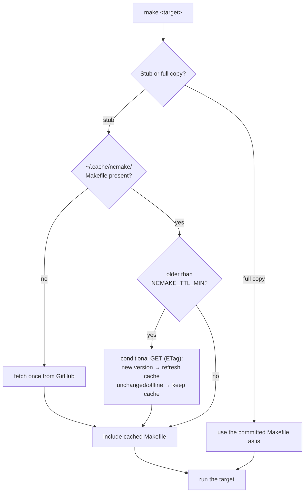
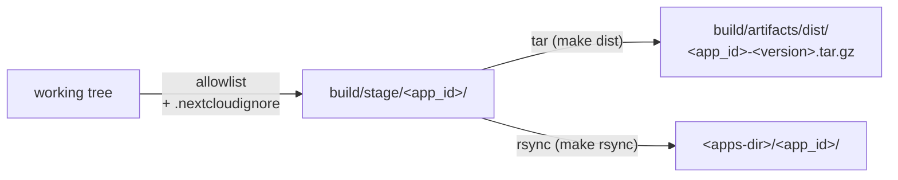
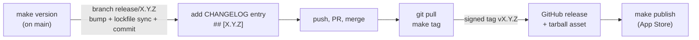

<!--
  - SPDX-FileCopyrightText: 2026 [ernolf] Raphael Gradenwitz <raphael.gradenwitz@googlemail.com>
  - SPDX-License-Identifier: MIT
-->
# ncmake

The Swiss Army knife for Nextcloud app development: one generic `Makefile` for building, packaging, deploying, versioning and App Store management of a Nextcloud app.

Everything is derived from the app itself, so there is nothing to configure for a standard app: drop it in, run `make`, done. The package managers run in throwaway containers, so the host needs neither PHP nor Node.

- [Installation](#installation)
- [What happens when you run make](#what-happens-when-you-run-make)
- [How ncmake understands your app](#how-ncmake-understands-your-app)
- [The container runtime](#the-container-runtime)
- [Building](#building)
- [Packaging: the shipped file set](#packaging-the-shipped-file-set)
- [Deploying to a test instance](#deploying-to-a-test-instance)
- [Releasing](#releasing)
- [App Store management](#app-store-management)
- [Per-app tuning](#per-app-tuning)
- [Variables](#variables)
- [Target reference](#target-reference)
- [Requirements](#requirements)

## Installation

### The bootstrap stub (recommended)

Put the bootstrap stub into the root of your app repository, once:

```sh
curl -fLO https://raw.githubusercontent.com/ernolf/ncmake/main/bootstrap/Makefile
git add Makefile
```

The stub is a dozen lines that never change. It fetches the real Makefile into a per-machine cache and includes it from there. Every developer who clones your app and runs `make` automatically gets the current ncmake, on every machine, for every app, from one shared cache.

**What lands in your repository: only the stub.** The stub file you committed stays byte-identical forever; the fetched Makefile lives in `~/.cache/ncmake/`, outside of every project. Running `make` creates or modifies nothing in your checkout (apart from the usual build outputs such as `build/`, `js/` and `vendor/`, which belong in your `.gitignore` anyway, as in every Nextcloud app). `git status` stays clean; there is nothing extra to ignore.

**How the cache stays current.** At most once per day (`NCMAKE_TTL_MIN`, default 1440 minutes) the cached Makefile checks upstream with a conditional GET (ETag): unchanged or offline keeps the cache, a new version replaces it and is used from the next run on. `make self-update` forces a refresh at any time.

**Pinning a version.** By default the stub follows the `main` branch. To pin your app to a fixed ncmake version, set `NCMAKE_REF` in the stub to a tag:

```make
NCMAKE_REF ?= v1.0.0
```

### The full copy (self-contained alternative)

If you prefer a repository without any fetch-at-build-time behavior, commit the full `Makefile` instead:

```sh
curl -fLO https://raw.githubusercontent.com/ernolf/ncmake/main/Makefile
```

A committed copy never modifies itself. `make self-update` downloads the newest version over it; review the diff and commit it like any other change.

## What happens when you run make



The first `make` after a fresh `git clone` needs network once (to fill the cache); after that everything works offline.

## How ncmake understands your app

Nothing is configured twice, everything is read from files your app has anyway:

| Fact | Source |
|---|---|
| App id | `<id>` in `appinfo/info.xml` |
| Version | `<version>` in `appinfo/info.xml` |
| PHP build needed? | `composer.json` declares runtime requirements (anything besides `php` and `ext-*`) |
| Frontend build needed? | `package.json` has a `build` script |
| Is `js/` (or `vendor/`) a build artifact? | `.gitignore` (evaluated via `git check-ignore`) |
| PHP container image | minimum PHP version in `appinfo/info.xml` |
| Node container image | `engines.node` in `package.json` |

The `.gitignore` line deserves a word: when `js/` is gitignored, it is a build output and must exist before packaging (`make dist` refuses otherwise and tells you to run `make build`). When `js/` is committed, as in apps that ship their built frontend in git, a fresh checkout is already complete and packages without building. The same logic applies to `vendor/`.

The tarball and the deployed directory are always named after the **app id**, regardless of what your checkout directory is called.

## The container runtime

`composer` and `npm` never run on your host by default. Each invocation starts a throwaway container (`--rm`), does its work in your mounted checkout and disappears. Your host needs no PHP, no Node, no version juggling, and you can build against exactly the PHP the app declares as its minimum.

The runtime is auto-detected (podman preferred, then docker) and can be chosen per call, for example `make build RUNTIME=docker`:

| `RUNTIME=` | What it is | Notes |
|---|---|---|
| `podman-rootless` | rootless podman (default when podman exists) | daemonless, no idle cost, files owned by you |
| `docker` | standard rootful docker | ncmake maps your uid/gid into the container, so no root-owned files appear |
| `docker-rootless` | rootless docker | |
| `bare` | no container | composer and npm must be on the PATH |

The images are derived, never hardcoded: PHP runs in `ghcr.io/nextcloud/continuous-integration-php<min>` (the same images the Nextcloud CI uses, with all required extensions), Node in `node:<major>` from your `engines.node`. Both can be overridden (see [Variables](#variables)).

On SELinux hosts (Fedora, RHEL) bind mounts may need a `:z` label; if you hit permission errors there, run with `RUNTIME=bare` or adjust your container policy.

## Building

```sh
make build
```

runs the detected build commands, each in its container:

- `composer install --no-dev --no-scripts --prefer-dist --no-progress` when `composer.json` declares runtime requirements
- `npm ci && npm run build` when `package.json` has a `build` script

When a side does not apply, it is skipped with a note. Apps with special build steps override the commands in `ncmake.mk` (see [Per-app tuning](#per-app-tuning)).

`make dist-clean` resets to a pristine checkout first (it removes every git-ignored build output: `vendor/`, `node_modules/`, `js/`, caches), so

```sh
make dist-clean && make build
```

is the reproducible from-scratch build.

## Packaging: the shipped file set

What ends up in a release is defined as an **allowlist** (the keep model), not as an exclude list. Shipped are the standard app paths, each only when it exists:

```
appinfo/ lib/ l10n/ templates/ img/ css/ js/ vendor/ LICENSES/
CHANGELOG.md AUTHORS.md REUSE.toml COPYING COPYING.md LICENSE LICENSE.md
```

A new dev file in your repository can never leak into the tarball, because it is not on the list. A missing runtime directory fails loudly instead of silently shipping a broken app.



`make dist` materializes the file set once into a staging directory and packs it; `make rsync` deploys the very same staging directory. One mechanism, one source of truth: what you deploy for testing is byte-for-byte what a release ships.

## Deploying to a test instance

```sh
make build
make rsync TARGET=/var/www/nextcloud/apps/
```

`TARGET` is the `apps/` parent directory, locally or over SSH (`user@host:/var/www/nextcloud/apps/`); the app subdirectory is appended automatically and synced with `--delete`, so removed files disappear from the instance too.

The `occ` calls and ownership around it are your job (they depend on your instance), typically:

```sh
occ app:disable myapp && make rsync TARGET=/var/www/nextcloud/apps/ && chown -R www-data:www-data /var/www/nextcloud/apps/myapp && occ app:enable myapp
```

The disable/enable cycle makes Nextcloud re-read `info.xml` and run pending migrations.

## Releasing

The release flow assumes a protected `main` (required checks, no direct pushes), which is good practice anyway:



**`make version`** (run on `main`) prompts for the new version, validates it against the latest tag (`sort -V`, must be greater), branches off into `release/X.Y.Z` and commits the bump there: `appinfo/info.xml`, plus `composer.json`/`package.json` when present, plus the re-synced lockfiles (synced inside the containers, so the bump commit is complete and CI-clean).

**`make tag`** (back on `main`, after the merge) refuses to re-tag, warns when `CHANGELOG.md` has no `## [X.Y.Z]` section, shows a fat reminder that a tag freezes the current commit, then creates and pushes the **signed** `vX.Y.Z` tag after your confirmation.

`make dist` builds the tarball to attach to the GitHub release, `make sign` prints its base64 signature, `make release` does both in one step.

## App Store management

The maintainer targets talk directly to the [App Store REST API](https://nextcloudappstore.readthedocs.io/en/latest/developer.html). They expect three files under `~/.nextcloud/certificates/` (change with `cert_dir=`):

| File | Purpose |
|---|---|
| `<app_id>.crt` (or `.cert`, both are accepted) | the app certificate issued via [app-certificate-requests](https://github.com/nextcloud/app-certificate-requests) |
| `<app_id>.key` | the private key |
| `appstore_api-token` | your API token from the App Store account page |

`make help` shows for each of the three whether it was found (green check or red cross, with the real filename).

| Target | What it does |
|---|---|
| `make register` | registers the app id and certificate, one time |
| `make publish` | submits a release: prompts for the GitHub download URL of the tarball, signs and posts it |
| `make list-releases` | your published releases, compact JSON |
| `make list-releases-full` | the full App Store entry |
| `make list-for-author` | all apps of an author (prompts for a name) |
| `make delete-release` | deletes one release, interactively, with confirmation |
| `make ratings` | ratings and comments for the app |

The read-only list targets cache `apps.json` with ETag revalidation under `build/cache/`, so repeated calls are fast and gentle to the API.

## Per-app tuning

Most apps need none of this.

**`.nextcloudignore`** removes files from within the shipped set (rsync exclude syntax, one pattern per line), for example test ballast inside shipped vendor packages:

```
/vendor/*/*/tests/
```

**`ncmake.mk`** in the app root overrides single variables in plain make syntax. It is included first, so anything set there wins:

```make
keep_extra     = resources               # extra runtime paths to ship
php_build_cmd  = composer install --no-dev && php bin/generate.php
node_build_cmd =                         # empty = skip the npm build
php_image      = ghcr.io/nextcloud/continuous-integration-php8.2:latest
```

## Variables

Set on the command line (`make build RUNTIME=bare`), in the environment, or persistently in `ncmake.mk`.

| Variable | Default | Purpose |
|---|---|---|
| `RUNTIME` | auto (`podman-rootless`, else `docker`) | container runtime: `podman-rootless`, `docker`, `docker-rootless`, `bare` |
| `TARGET` | (required by `make rsync`) | apps parent directory, local or `user@host:` |
| `cert_dir` | `~/.nextcloud/certificates` | location of certificate, key and API token |
| `php_image` | `ghcr.io/nextcloud/continuous-integration-php<min>` | PHP container image |
| `node_image` | `node:<engines.node major>` | Node container image |
| `keep_extra` | (empty) | additional paths for the shipped file set |
| `php_build_cmd` | auto-detected | PHP-side build command, empty skips |
| `node_build_cmd` | auto-detected | frontend build command, empty skips |
| `NCMAKE_REF` | `main` | branch or tag the stub fetches |
| `NCMAKE_DIR` | `~/.cache/ncmake` | cache location of the shared Makefile |
| `NCMAKE_TTL_MIN` | `1440` | minutes between upstream freshness checks |

## Target reference

`make` without a target prints the annotated help, including the detected app, version and certificate status.

| Area | Targets |
|---|---|
| Release versioning | `version`, `tag` |
| Build | `build`, `dist`, `sign`, `release` |
| Local deploy | `rsync TARGET=...` |
| App Store | `register`, `publish`, `list-releases`, `list-releases-full`, `list-for-author`, `delete-release`, `ratings` |
| Utility | `clean`, `dist-clean`, `self-update`, `help` |

Targets marked `[m]` in the help are maintainer-only: they need repository write access and/or the App Store signing key. Everything else works for anyone who clones the app.

## Requirements

GNU make, git, curl, openssl, rsync, xmllint (libxml2), python3. Optional: podman or docker for containerized builds (strongly recommended; without them use `RUNTIME=bare` and provide composer and npm yourself).

## License

[MIT](LICENSE)
