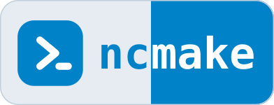

<!--
  - SPDX-FileCopyrightText: 2026 [ernolf] Raphael Gradenwitz <raphael.gradenwitz@googlemail.com>
  - SPDX-License-Identifier: MIT
-->
# 

[](https://api.reuse.software/info/github.com/ernolf/ncmake)

The Swiss Army knife for Nextcloud app development: one generic `Makefile` for building, packaging, deploying, versioning and App Store management of a Nextcloud app.

Everything is derived from the app itself, so a standard app needs no build config at all — drop it in, run `make`, done. Composer and npm run in throwaway containers, so the host needs neither PHP nor Node.

> [!TIP]
> **📖 The full documentation lives in the [ncmake wiki](https://github.com/ernolf/ncmake/wiki).** This page is just the quick start — every guide, reference and background piece is a wiki page, kept current there.

## Quick start

Commit the bootstrap stub as your app's `Makefile`, once:

```sh
curl -fLO https://raw.githubusercontent.com/ernolf/ncmake/main/bootstrap/Makefile
git add Makefile
```

That single dozen-line file is all your repository carries: it fetches the real Makefile into a per-machine cache and includes it from there, so every clone of your app runs the current ncmake from one shared cache — nothing else lands in your checkout. Then:

```sh
make            # colorized, annotated help with your app id, version and cert status
make build      # composer + npm, each in a throwaway container
make dist       # stage the runtime file set and pack the release tarball
```

New here? Start with **[Getting started](https://github.com/ernolf/ncmake/wiki/Getting-started)** and the **[step-by-step walkthrough](https://github.com/ernolf/ncmake/wiki/Step-by-step)**.

## What ncmake does

- **No host toolchain** — composer and npm run in throwaway containers on the PHP and Node versions the app declares; you need only podman or docker.
- **Nothing to configure** — app id, version, build steps and the shipped file set are read from `info.xml`, `composer.json`, `package.json` and `.gitignore`.
- **Keep-model packaging** — a release ships an allowlist of runtime paths, so a stray dev file can never leak in, and the same staged set feeds `dist`, `rsync` and `cp`.
- **One shared, self-updating Makefile** — a dozen-line stub per app; update ncmake once and every app on the machine follows.
- **The full release lifecycle** — a validated version bump, a changelog from your conventional commits, a signed tag, and App Store signing and publishing.
- **Managed CI workflows** — installed from upstream templates, tracked against local edits, and kept current by an auto-updater that opens pull requests.

Wondering how it compares to [krankerl](https://github.com/ChristophWurst/krankerl), or why it is built this way? → **[Why ncmake](https://github.com/ernolf/ncmake/wiki/Why-ncmake)**

## Documentation

Everything is in the **[wiki](https://github.com/ernolf/ncmake/wiki)**; its sidebar has the full set. Good entry points:

- **New to ncmake** → [Getting started](https://github.com/ernolf/ncmake/wiki/Getting-started) · [Step by step](https://github.com/ernolf/ncmake/wiki/Step-by-step)
- **Building & releasing** → [How ncmake understands your app](https://github.com/ernolf/ncmake/wiki/How-ncmake-understands-your-app) · [Building and packaging](https://github.com/ernolf/ncmake/wiki/Building-and-packaging) · [Releasing](https://github.com/ernolf/ncmake/wiki/Releasing) · [Per-app tuning](https://github.com/ernolf/ncmake/wiki/Per-app-tuning) · [Target reference](https://github.com/ernolf/ncmake/wiki/Target-reference)
- **CI workflows** → [Workflows](https://github.com/ernolf/ncmake/wiki/Workflows) · [Workflow updater](https://github.com/ernolf/ncmake/wiki/Workflow-updater) · [GitHub App](https://github.com/ernolf/ncmake/wiki/GitHub-App) · [GitHub PAT](https://github.com/ernolf/ncmake/wiki/GitHub-PAT) · [Deleting merged branches](https://github.com/ernolf/ncmake/wiki/Deleting-merged-branches)
- **App Store** → [App Store](https://github.com/ernolf/ncmake/wiki/App-Store)
- **Installing an ncmake app** (for your app's users) → [Installation](https://github.com/ernolf/ncmake/wiki/Installation)

## Requirements

GNU make, git, curl, openssl, rsync, python3; optionally `xmllint` (ncmake falls back to `grep` without it). For containerized builds: podman or docker — otherwise `RUNTIME=bare` with composer and npm on the `PATH`.

## Show that your app uses ncmake

If ncmake is useful to you, add the badge to your app's README (see [Getting started](https://github.com/ernolf/ncmake/wiki/Getting-started#-show-that-your-app-uses-ncmake)):

[](https://github.com/ernolf/ncmake)

```markdown
[](https://github.com/ernolf/ncmake)
```

## License

[MIT](LICENSE)
