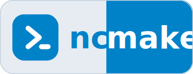
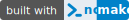

<!--
  - SPDX-FileCopyrightText: 2026 [ernolf] Raphael Gradenwitz <raphael.gradenwitz@googlemail.com>
  - SPDX-License-Identifier: MIT
-->
# ncmake brand assets

The ncmake mark is the build-tool chevron `❯` with a cursor, in Nextcloud blue (`#0082c9`). One vector source per context; export to PNG only where a raster is required (the GitHub App / bot icon).

## Files

| Preview | File | Use |
|---|---|---|
|  | `ncmake.svg` | Primary mark (blue tile). Icons, favicon, bot avatar (export to PNG). |
|  | `ncmake-inverted.svg` | White tile, blue mark. On coloured or photographic surfaces. |
|  | `ncmake-glyph.svg` | Bare chevron, blue. Inline in prose (works on light and dark). |
| <picture><source media="(prefers-color-scheme: dark)" srcset="ncmake-glyph-white.svg"></picture> | `ncmake-glyph-white.svg` | Bare chevron, white. Inline on a solid dark background. |
|  | `ncmake-lockup.svg` | Tile + wordmark. `ncmake` is one word; the background alone breaks light→blue between `c` and `m`. README header, legible on white and on dark. |
|  | `ncmake-mark.svg` | Compact horizontal mark: chevron + `ncmake`, same light→blue background break. Scalable; use inline or as a small brand tag. |
|  | `ncmake-badge.svg` | `built with` label + the mark, at badge geometry. Drops into the README badge row. |
|  | `ncmake-hex.svg` | Hexagon silhouette. Kept for contexts where hexagons are the house style. |
|  | `ncmake-avatar.svg` / `ncmake-avatar.png` | Round mark on a full-bleed circle. Bot / GitHub App avatar. PNG is 512×512 with transparent corners. |

## Snippets

**README header** — one image, always readable because it brings its own two panels and a hairline edge:

```markdown

```

**"built with ncmake" badge** — self-contained SVG (a two-colour value part is not possible with a plain Shields.io badge). In this repo:

```markdown
[](https://github.com/ernolf/ncmake)
```

From another repo, serve it through a CDN that sends the correct SVG content type:

```markdown
[](https://github.com/ernolf/ncmake)
```

**Inline mark in a sentence** (for example in `doc/INSTALL.md`) — either the bare chevron next to the word, or the whole `ncmake` mark as one image:

```markdown
built and packaged with  **ncmake**
built and packaged with 
```

**Bot / GitHub App icon** — upload `ncmake-avatar.png` (512×512, round) under the app's *Display information*. Regenerate it from the source with:

```sh
rsvg-convert -w 512 -h 512 -f png ncmake-avatar.svg > ncmake-avatar.png
```

## Colour

Nextcloud blue `#0082c9` throughout, so the mark stays in the Nextcloud family. The lockup's light panel is `#e6ecf2` with a `#c3d0dc` hairline edge; the right panel is the same `#0082c9`.
